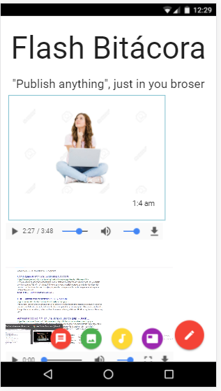

# BITÁCORA

## Descripción

El reto de este proyecto consiste en crear una bitácora, donde el usuario pueda añadir texto, imagen, audio y video. 

## Herramientas utilizadas 
 1. **HTML 5** : Estructura de la página.
 2. **JQUERY** : Lenguaje de programación.
 3. **File API** : APIs.
 4. **Audio y Vídeo** : APIs.
 5. **Date input** :APIs. 
 6. **MATERIALIZE** : Utilizado en el diseño. 

## Resultado

 

